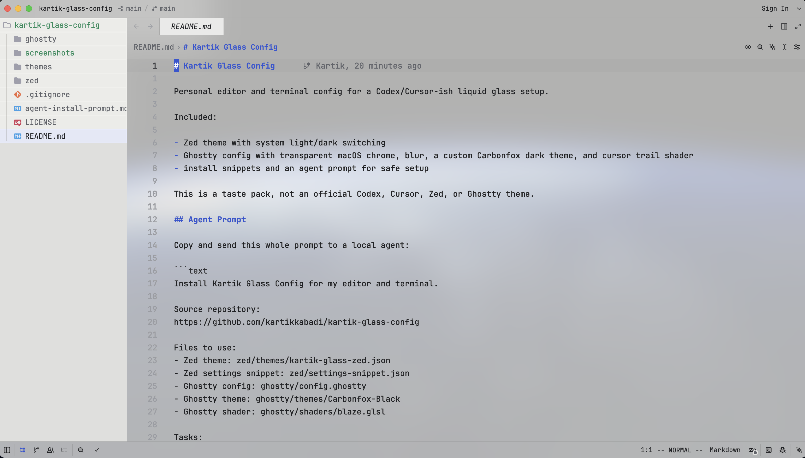
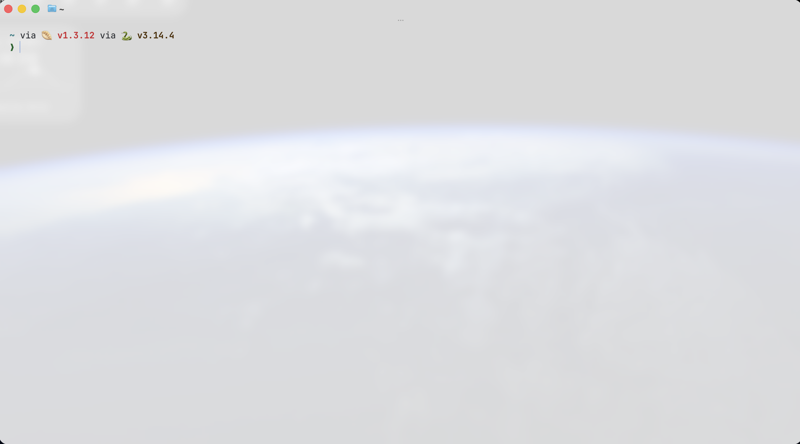
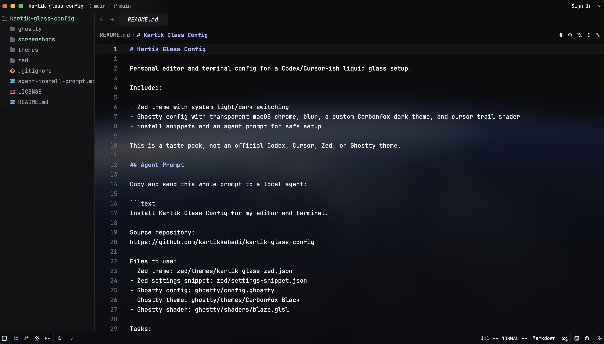
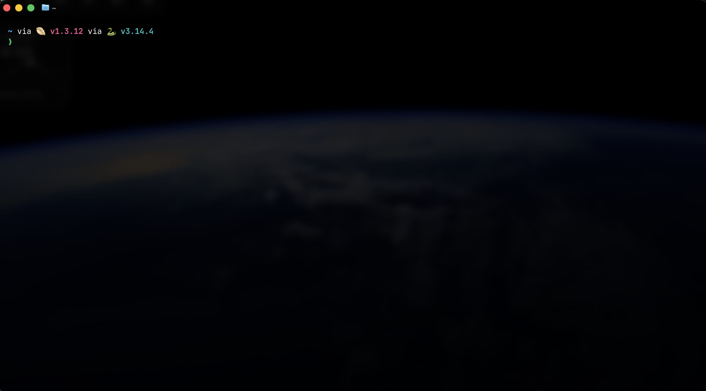

# Kartik Glass Config

Personal editor and terminal config for a Codex/Cursor-ish liquid glass setup.

Included:

- Zed theme with system light/dark switching
- Ghostty config with transparent macOS chrome, blur, a custom Carbonfox dark theme, and cursor trail shader
- install snippets and an agent prompt for safe setup

This is a taste pack, not an official Codex, Cursor, Zed, or Ghostty theme.

## Screenshots

### Light Mode





### Dark Mode





## Agent Prompt

Copy and send this whole prompt to a local agent:

```text
Install Kartik Glass Config for my editor and terminal.

Source repository:
https://github.com/kartikkabadi/kartik-glass-config

Files to use:
- Zed theme: zed/themes/kartik-glass-zed.json
- Zed settings snippet: zed/settings-snippet.json
- Ghostty config: ghostty/config.ghostty
- Ghostty theme: ghostty/themes/Carbonfox-Black
- Ghostty shader: ghostty/shaders/blaze.glsl

Tasks:
1. Fetch or clone the repository above into a temporary/local working folder.
2. Inspect my Zed and Ghostty config locations and identify the active files.
3. Install `zed/themes/kartik-glass-zed.json` into the Zed themes directory.
4. Merge `zed/settings-snippet.json` into my Zed settings without deleting unrelated settings.
5. Keep Zed `theme.mode` set to `system`.
6. Verify the Zed theme names exist:
   - Kartik Glass Light
   - Kartik Glass Dark
7. Install Ghostty files:
   - `ghostty/config.ghostty`
   - `ghostty/themes/Carbonfox-Black`
   - `ghostty/shaders/blaze.glsl`
8. Preserve my existing configs by backing them up or showing a diff before overwriting.
9. Validate JSON for Zed and check Ghostty config paths.
10. Report exactly what changed and whether either app needs a reload.

Do not read secrets, auth files, browser profiles, shell history, or unrelated dotfiles.
Do not overwrite unrelated settings.
```

## Contents

```text
zed/
  themes/kartik-glass-zed.json
  settings-snippet.json

ghostty/
  config.ghostty
  themes/Carbonfox-Black
  shaders/blaze.glsl

agent-install-prompt.md
```

## Zed

Copy the Zed theme:

```sh
mkdir -p ~/.config/zed/themes
cp zed/themes/kartik-glass-zed.json ~/.config/zed/themes/kartik-glass-zed.json
```

Merge this into `~/.config/zed/settings.json`:

```json
{
  "theme": {
    "mode": "system",
    "light": "Kartik Glass Light",
    "dark": "Kartik Glass Dark"
  }
}
```

Optional icon setup:

```json
{
  "icon_theme": {
    "mode": "system",
    "light": "Light Charmed Icons",
    "dark": "Soft Charmed Icons"
  }
}
```

The icon theme names come from the `charmed-icons` Zed extension. Remove that block if you do not use it.

## Ghostty

Ghostty supports more than one config location depending on install and platform. On macOS, the active app config is often:

```text
~/Library/Application Support/com.mitchellh.ghostty/config.ghostty
```

Install the included files:

```sh
mkdir -p "$HOME/Library/Application Support/com.mitchellh.ghostty"
mkdir -p "$HOME/Library/Application Support/com.mitchellh.ghostty/themes"
mkdir -p "$HOME/Library/Application Support/com.mitchellh.ghostty/shaders"

cp ghostty/config.ghostty "$HOME/Library/Application Support/com.mitchellh.ghostty/config.ghostty"
cp ghostty/themes/Carbonfox-Black "$HOME/Library/Application Support/com.mitchellh.ghostty/themes/Carbonfox-Black"
cp ghostty/shaders/blaze.glsl "$HOME/Library/Application Support/com.mitchellh.ghostty/shaders/blaze.glsl"
```

Then reload Ghostty with `Super+Shift+R` or restart the app.

## Publish Checklist

Before publishing a fork or variant:

- `jq empty zed/themes/kartik-glass-zed.json zed/settings-snippet.json`
- Check that docs do not include private machine paths beyond generic `~` examples.
- Do not commit Zed prompt databases, extension caches, Ghostty logs, shell history, or auth material.
- Keep install instructions explicit. Avoid remote script execution such as `curl | sh`.

## License

MIT
